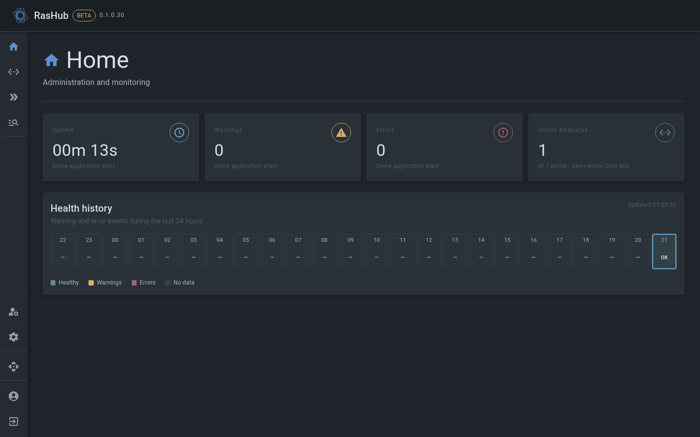
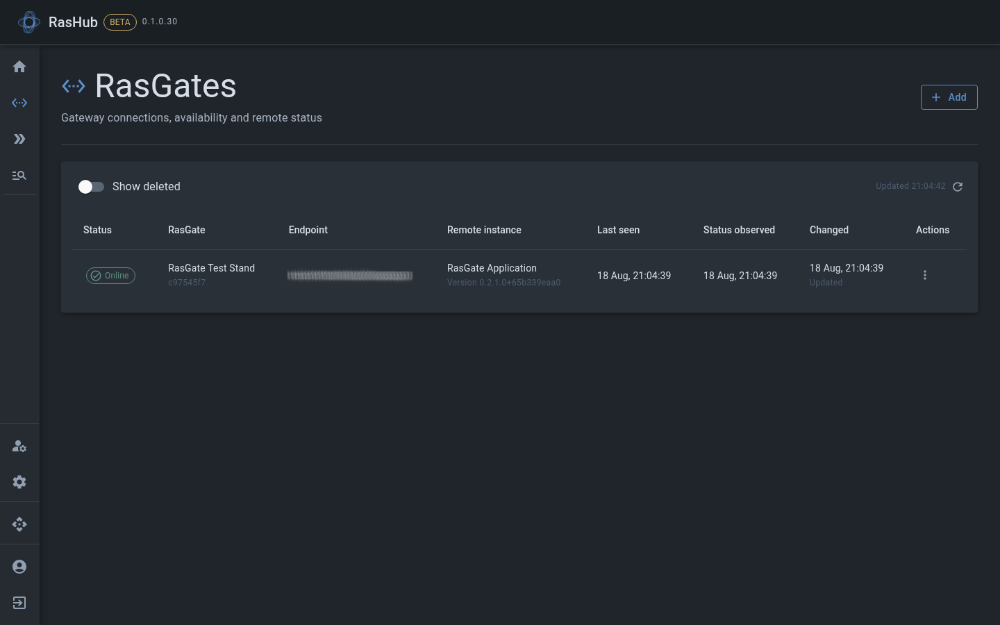
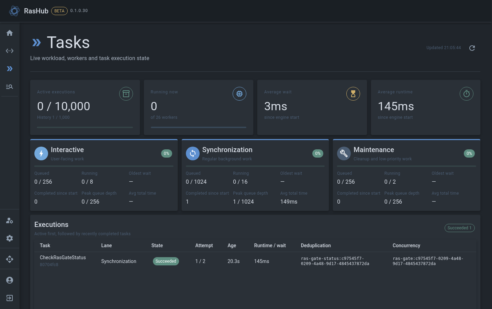

[English](README.md) \| [Русский](README.ru.md)

# RasHub

RasHub — центральный сервис Ras Ecosystem, объединяющий
[RasStudio](https://github.com/RasEcosystem/ras-studio) и
[RasGate](https://github.com/RasEcosystem/ras-gate) для управления
инфраструктурой RAS 1С:Предприятия.

## 0.1.0

Управление RasGate, синхронизация кластеров RAS, фоновые задачи и мониторинг состояния.

